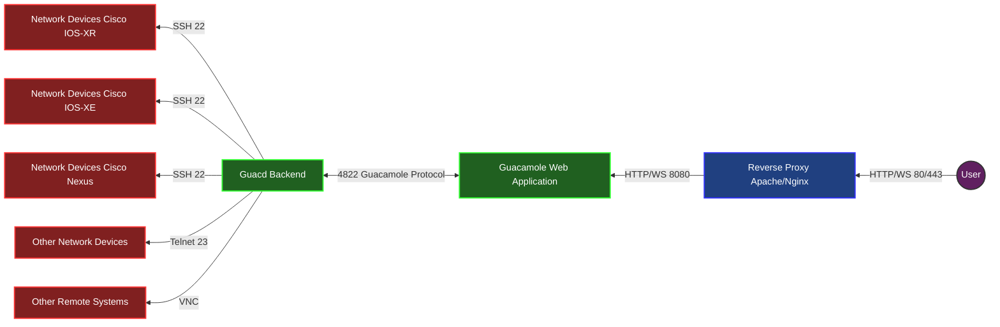

# Apache Guacamole Installation Guide with Cisco IOS-XR Fix

*Reference: [Guacamole Docker Documentation](https://guacamole.apache.org/doc/gug/guacamole-docker.html)*

## Architecture Overview

The following diagram illustrates the Guacamole architecture and connection flow:



This architecture enables users to access various network devices through a web browser, with all connections securely managed by the Guacamole system.

## Modifying guacamole-server to Fix "Unable to allocate PTY on Cisco IOS-XR"

1. Clone the guacamole-server repository from GitHub:
```sh
git clone https://github.com/apache/guacamole-server
```

2. Patch the function `void* ssh_client_thread(void* data);` in the `src/protocols/ssh/ssh.c` file:

```patch
diff --git a/src/protocols/ssh/ssh.c b/src/protocols/ssh/ssh.c
index 7c3ac05c..e7e2685b 100644
--- a/src/protocols/ssh/ssh.c
+++ b/src/protocols/ssh/ssh.c
@@ -384,8 +384,9 @@ void* ssh_client_thread(void* data) {
     if (libssh2_channel_request_pty_ex(ssh_client->term_channel,
             settings->terminal_type, strlen(settings->terminal_type),
             ssh_ttymodes, ttymodeBytes, term_width, term_height, 0, 0)) {
-        guac_client_abort(client, GUAC_PROTOCOL_STATUS_UPSTREAM_ERROR, "Unable to allocate PTY.");
-        return NULL;
+        // ignore this error, although PTY cannot be allocated, connection can still be used.
+        // guac_client_abort(client, GUAC_PROTOCOL_STATUS_UPSTREAM_ERROR, "Unable to allocate PTY.");
+        // return NULL;
     }

     /* Forward specified locale */
```

3. Build the Docker image with the patch:
```sh
docker build -t guacd:1.5.5-fix-ios-xr .
```

## Setting Up Docker Compose

1. Create a `docker-compose.yaml` file with the following content:
```yaml
services:
  database:
    image: postgres:17
    environment:
      POSTGRES_USER: guacd
      POSTGRES_PASSWORD: guacd
      POSTGRES_DB: guacd
    volumes:
      - database:/var/lib/postgresql/data
    restart: unless-stopped
  guacd:
    image: guacd:1.5.5-fix-ios-xr
    volumes:
      - ./tty-records:/home/guacd/tty-records
    restart: unless-stopped
  web:
    image: guacamole/guacamole:1.5.5
    environment:
      GUACD_HOSTNAME: guacd
      GUACD_PORT: 4822
      POSTGRESQL_HOSTNAME: database
      POSTGRESQL_PORT: 5432
      POSTGRESQL_DATABASE: guacd
      POSTGRESQL_USER: guacd
      POSTGRESQL_PASSWORD: guacd
    restart: unless-stopped
    depends_on:
      - guacd
      - database
    ports:
      - 8080:8080
volumes:
  database: {}
```

2. Start the database container:
```sh
docker compose up -d database
```

3. Generate the PostgreSQL initialization SQL file:
```sh
docker run --rm guacamole/guacamole:1.5.5 /opt/guacamole/bin/initdb.sh --postgresql > initdb.sql
```

4. Initialize the database with the generated SQL file:
```sh
cat initdb.sql | docker exec -i guacamole-database-1 psql -U guacd
```

5. Start the remaining services:
```sh
docker compose up -d
```

Once completed, you can access the Guacamole web interface at http://localhost:8080/guacamole/ with the default credentials (username: `guacadmin`, password: `guacadmin`).

## Setting Up a Reverse Proxy

*Reference: [Proxying Guacamole](https://guacamole.apache.org/doc/gug/reverse-proxy.html)*

Guacamole supports various reverse proxy servers, such as Apache or Nginx. You can follow the documentation to set up a reverse proxy.

If you need to configure SSL, please refer to the Apache or Nginx official documentation for proper setup instructions.

## User Management

*Reference: [Administration → User Management](https://guacamole.apache.org/doc/gug/administration.html#user-management)*

### User Permission List:
- Administer system
- Create new users
- Create new user groups
- Create new connections
- Create new connection groups
- Create new sharing profiles
- Change own password

## Device Management

*Reference: [Administration → Connections and Connection Groups](https://guacamole.apache.org/doc/gug/administration.html#connections-and-connection-groups)*

## Session Management

*Reference: [Administration → Managing Sessions](https://guacamole.apache.org/doc/gug/administration.html#managing-sessions)*

## Using the API to Create Devices and Groups

The following Python script demonstrates how to use the Guacamole API to create connection groups and devices programmatically:

```python
import requests

# You should store these configuration values in environment variables or a secure vault.
GUACAMOLE_API_ENDPOINT = "http://localhost:8080/guacamole/api"
GUACA_USER = "guacadmin"
GUACA_PASS = "guacadmin"


def get_auth_token():
    resp = requests.post(f'{GUACAMOLE_API_ENDPOINT}/tokens',
                         headers={
        'Content-Type': 'application/x-www-form-urlencoded'
    }, data={
        "username": GUACA_USER,
        "password": GUACA_PASS
    })
    if resp and resp.status_code == 200:
        token = resp.json().get('authToken')
        return token

def create_connection_group(token, name, parent_id):
    resp = requests.post(f'{GUACAMOLE_API_ENDPOINT}/session/data/postgresql/connectionGroups?token={token}',
                json={
                    "parentIdentifier": str(parent_id),
                    "name": name,
                    "type": "ORGANIZATIONAL",
                    "attributes": {
                        "max-connections": "",
                        "max-connections-per-user": "",
                        "enable-session-affinity": ""
                    }
                })
    return resp.json()

def create_connection(token, parent_id, name):
    data = {
        "parentIdentifier": str(parent_id),
        "name": name,
        "protocol": "ssh",
        "attributes": {
            "guacd-hostname": "guacd",
            "guacd-port": "4822",
            "guacd-encryption": "none"
        },
        "parameters": {
            "hostname":"localhost",
            "username":"guest",
            "password":"guest",
            "port":"22"
        }
    }
    requests.post(f'{GUACAMOLE_API_ENDPOINT}/session/data/postgresql/connections?token={token}', json=data)

def delete_connection(token, id):
    requests.delete(f'{GUACAMOLE_API_ENDPOINT}/session/data/postgresql/connections/{id}?token={token}')

def main():
    auth_token = get_auth_token()

    resp = requests.get(f'{GUACAMOLE_API_ENDPOINT}/session/data/postgresql/connectionGroups?token={auth_token}')
    print(resp.json())


    # resp = requests.get(f'{GUACAMOLE_API_ENDPOINT}/session/data/postgresql/connections?token={auth_token}')
    # conns = resp.json()
    # # get all keys in conns
    # for key in conns:
    #     name = conns[key].get('name')
    #     if 'demo-dev' in name:
    #         delete_connection(auth_token, key)

    # Create connection groups and devices
    device_counter = 1
    # Create tier1 (10 groups)
    for i in range(10):
        t1_group_name = "demo-t1-%02d" % (i + 1)
        t1_new_group = create_connection_group(auth_token, t1_group_name, '4')

        # Create tier2 (60 groups per tier1)
        for j in range(60):
            t2_group_name = "%s-t2-%02d" % (t1_group_name, j + 1)
            t2_new_group = create_connection_group(auth_token, t2_group_name, t1_new_group.get('identifier'))

            # Create 100 connections in each tier2 group
            for l in range(100):
                print('create device - ' + str(device_counter))
                create_connection(auth_token, t2_new_group.get('identifier'), 'demo-dev-%06d' % device_counter )
                device_counter = device_counter + 1

    # Example response structure:
    # {'name': 'demo-t1-2', 'identifier': '6', 'parentIdentifier': '4', 'type': 'ORGANIZATIONAL', 
    #  'activeConnections': 0, 'attributes': {'max-connections': '', 'max-connections-per-user': '', 
    #  'enable-session-affinity': ''}}

    # Structure:
    # - Tier 1: 10 groups
    # - Tier 2: 60 groups per Tier 1 group
    # - Connections: 100 per Tier 2 group
    # Total: 60,000 connections (10 × 60 × 100)


if __name__ == "__main__":
    main()
```

## Importing Connections from CSV with Tree Structure

When managing connections in Guacamole, you may need to organize them in a hierarchical structure where the same rack name (e.g., "Rack10") might exist in different data centers (e.g., "DC1" and "DC2"). In this case, the full site path (e.g., "DC1/Rack10") is what makes each rack unique, not just the rack name.

The following script (`import_from_csv.py`) allows you to import connections from a CSV file while properly handling this hierarchical structure:

### Tree Structure

The script builds a tree structure where:
- Each node in the tree represents a connection group
- The full path to a node (e.g., "DC1/Rack10") is what makes it unique
- Connections are stored within their respective groups

This approach ensures that even if the same rack name exists in different data centers, they are treated as separate entities based on their full path.
