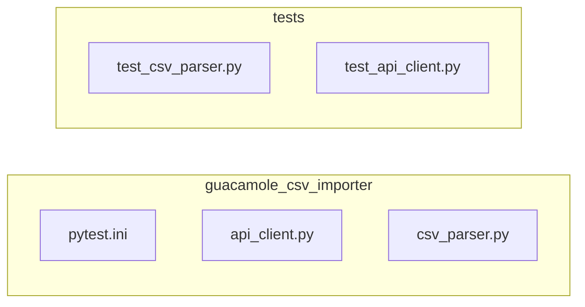

# Test Plan for `api_client.py`

This document outlines the plan for testing the `GuacamoleAPIClient` class in `guacamole_csv_importer/guacamole_csv_importer/api_client.py`.

## Testing Framework

We will use the `pytest` framework, following the conventions established in `guacamole_csv_importer/tests/test_csv_parser.py`.

## Test File

Tests will be located in a new file: `guacamole_csv_importer/tests/test_api_client.py`.

## Mocking

The `requests` library will be mocked to isolate tests and avoid making actual API calls.  This allows us to control the responses and test various scenarios, including error handling.

## Fixtures

Pytest fixtures will be used for setup and teardown, such as creating an authenticated client instance for use in multiple tests.

## Test Cases

The following test cases will be implemented, organized by method:

### `GuacamoleAPIClient.__init__`

*   **Initialization**:
    *   Test initialization with valid `base_url`, `username`, and `password`.
    *   Verify that `base_url`, `username`, and `password` are stored correctly.
    *   Verify that `self.token` is initially `None`.
    *   Verify that trailing slashes are removed from the `base_url`.

### `GuacamoleAPIClient.authenticate`

*   **Successful Authentication**:
    *   Verify that `self.token` is set after calling `authenticate()`.
*   **Failed Authentication**:
    *   Verify that `self.token` remains `None` with invalid credentials.
    *   Verify that the return value is `False` when authentication fails.
*   **Server Error**:
    *   Mock the response to simulate a server error during authentication.

### `GuacamoleAPIClient._get_auth_params`

*   **Valid Token**:
    *   Verify that the correct token dictionary is returned when authenticated.
*   **Not Authenticated**:
    *   Verify that a `ValueError` is raised when called before authentication.

### `GuacamoleAPIClient.get_connection_groups`

*   **Successful Retrieval**:
    *   Mock the response to simulate successful retrieval of connection groups.
*   **Authentication Failure**:
    *   Verify that a `ValueError` is raised when called without prior authentication.
*   **Server Error**:
    *   Mock the response to simulate a server error.

### `GuacamoleAPIClient.create_connection`

*   **Successful Creation**:
    *   Verify that a connection ID is returned upon successful creation.
*   **Invalid Connection Data**:
    *   Mock the response to simulate an error due to invalid `connection_data`.
*   **Authentication Failure**:
    *   Test behavior when called without prior authentication.
*   **Server Error**:
    *   Mock the response to simulate a server error.
    *   Test with missing `name` in `connection_data`.

### `GuacamoleAPIClient.create_connection_group`

*   **Successful Creation**:
    *   Verify that a group ID is returned upon successful creation.
*   **Invalid Input**:
    *   Test with invalid input, such as an empty group name.
*   **Authentication Failure**:
    *   Test behavior when called without prior authentication.
*   **Server Error**:
    *   Mock the response to simulate a server error.

## File Structure

## TODO List

- [ ] Create the `guacamole_csv_importer/tests/test_api_client.py` file.
- [ ] Implement the test fixtures (e.g., for an authenticated client).
- [ ] Implement the test cases for `GuacamoleAPIClient.__init__`.
- [ ] Implement the test cases for `GuacamoleAPIClient.authenticate`.
- [ ] Implement the test cases for `GuacamoleAPIClient._get_auth_params`.
- [ ] Implement the test cases for `GuacamoleAPIClient.get_connection_groups`.
- [ ] Implement the test cases for `GuacamoleAPIClient.create_connection`.
- [ ] Implement the test cases for `GuacamoleAPIClient.create_connection_group`.
- [ ] Ensure all tests pass.
